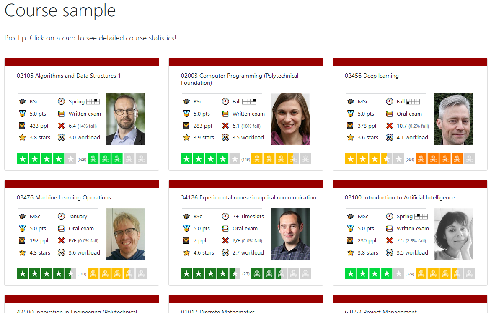
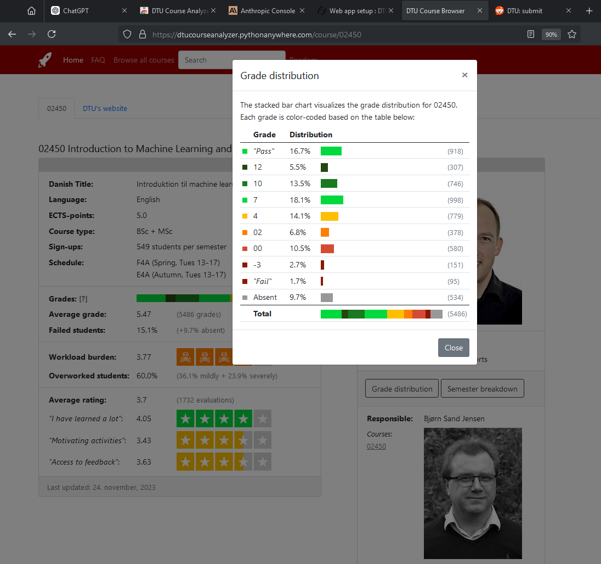
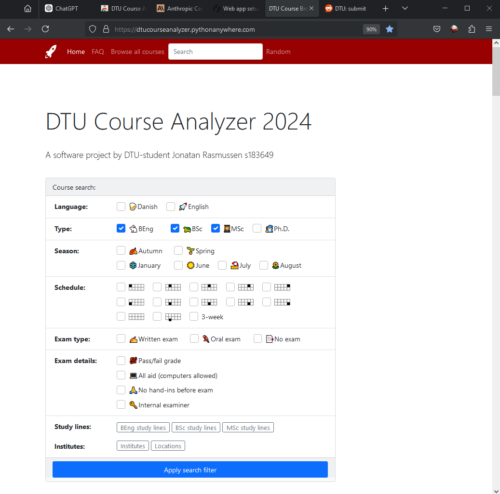

# DTU Course Analyzer

## Website link
[(Link to Website)](https://dtucourseanalyzer.pythonanywhere.com).

## How to run the website locally or fetch up-to-date course data
1. Clone/Download the repository. Ensure you have Python installed.
2. Pip install the python modules listed in requirements.txt (Python 3.11.7 or later is recommended).
3. Run website_launch.py and then visit http://127.0.0.1:5000 in your webbrowser.
4. (OPTIONAL) The repository already contains scraped data. To re-scrape the data from DTU's servers, run main.py and specify which academic years should be scraped at website/global_constants/config.py (Old data is available for download here: [CSV Files](https://github.com/JonatanRasmussen/dtu-course-browser/tree/main/website/static/csv_files).)

## About this GitHub repository
This repository contains all the code related to my personal project: the "DTU Course Analyzer" website (not to be confused with the [Google Chrome Extension of the same name](https://chromewebstore.google.com/detail/dtu-course-analyzer/bimhgdngikcnelkhjindmdghndfmdcde)). I have worked to this project on and off for years and the code base has gone through multiple re-writes. While the code is open-source, this was always intended to be a solo project. Most of the code was written when I was new to programming (this was before AI), but I've also refactored and maintained the code throughout the years to make scraping and updating the data as straightforward as possible. Simply run main.py to scrape the data and launch a local version of the website. Config is available at website/global_constants/config.py. For now I consider the project to be finished. However, I plan on keeping the site updated with the most recent data for as long as possible!

## Website screenshots

# Copy-paste of Website's FAQ section

## Website link
[(Link to Website)](https://dtucourseanalyzer.pythonanywhere.com)

## Who are you?
I am Jonatan Rasmussen, a danish student with a masters degree in Human-Centered Artificial Intelligence at DTU. This website is my personal project. I am not paid by, or affiliated with, DTU's administration.

## What is this site?
This website contains public course data for DTU's courses. It also offers more in-depth search filters than the official DTU websites as well as evaluation summaries and overviews.

## How do I use the website?
In the 'Home' tab, use the filter to search for whichever courses you are interested in. Click on any Course Card to see in-depth data for that specific course. For the Course Recommendation Tool, click the "Recommender" tab in the navbar to get started.

## Why did you make this?
Back in 2019 I started scraping DTU course data for fun because I liked the DTUCourseAnalyzer Chrome extension (I am NOT its author) but at the time, its data was out of date. Back then I was also new to programming, so it was a fun personal project. Initially, I just wanted to collect all the data in a big spreadsheet. Over time however, I collected more and more data and I wanted to make it browsable via a website. It is my goal that people can use this site to find and discover high-quality courses.

## How long did this take to make?
300 hours would be my rough estimate. I have contributed to this project on and off for years and the code base has gone through multiple full re-writes. Throughout the years, I have written 9.000 lines of Python, 6.000 lines of HTML and 5.000 lines of C#, totalling 20.000 lines of code (LOC). Note that most of this project's development was from before the AI era. This is all on my GitHub.

## Is the data up to date?
The most recent data is from the Summer Exams 2025. So yes, it is quite up-to-date. Fetching new data from DTU's websites is something I do via scripts that I manually need to run. So expect new data to be added to this website 1-2 times per year.

## How did you get the data?
I use [this site](https://kurser.dtu.dk/archive/volumes) to scrape all the course numbers. Then I use a Python script to go to `https://kurser.dtu.dk/course/01001`, `https://kurser.dtu.dk/course/01002`, and so on to scrape course data for all the 1700+ DTU courses. Note that I am not using an API, nor have I had any contact with DTU's administration.

## Can I get your raw data file(s)?
You can find the data on my GitHub. From here, it is possible to download all the data as one huge CSV: [CSV Files](https://github.com/JonatanRasmussen/dtu-course-browser/tree/main/website/static/csv_files).

## What are your future plans for this website?
I don't really know honestly. I don't have a lot of time these days, so I'm just maintaining the site at this point. I will however continue to update it with new data for as long as possible.

## Can you make a similar website for KU / AAU / SDU / RUC / (insert other university)?
Sadly this is not going to happen. The course data is completely different for non-DTU courses. I would have to re-write all of my code.

## I have found a bug!
That is not a question. Jokes aside, get in contact with me by reporting it on my [GitHub](https://github.com/JonatanRasmussen/dtu-course-browser) (I'm kinda new to running an open-source project however, so don't expect too much).

## May I leave now?
Yes. [(Return to Home Page)](https://dtucourseanalyzer.pythonanywhere.com)